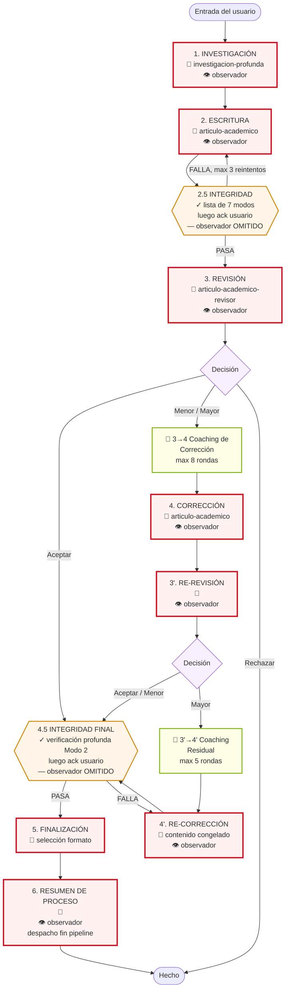
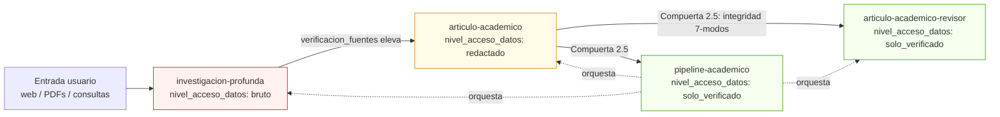
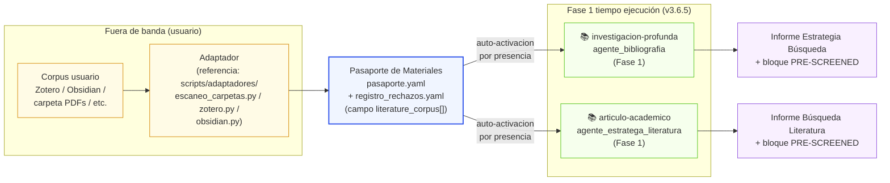
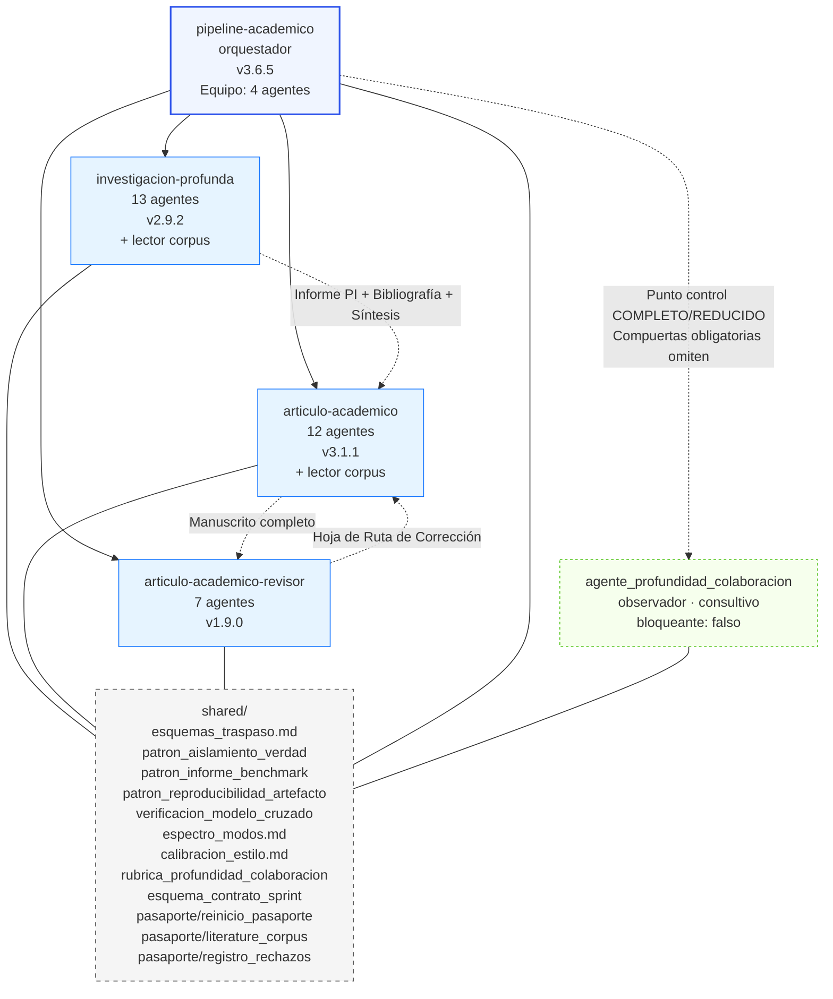
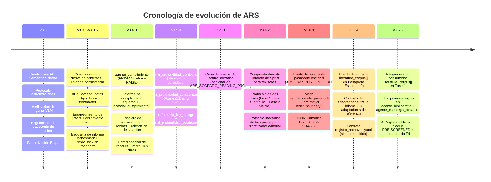

# Arquitectura del Pipeline ARS (v3.6.5)

Vista completa del pipeline a través de etapas × habilidades × artefactos × compuertas. Cada etapa completada requiere un punto de control de confirmación del usuario (según `pipeline-academico/HABILIDAD.md` y `pipeline_state_machine.md`); los diagramas a continuación resaltan visualmente los puntos de control **cargados de decisiones** para que sean fáciles de localizar. Los puntos de control de confirmación post-etapa en 2.5 y 4.5 son verificados primero por máquina y luego confirmados por el usuario; no se omiten.

## Cómo leer este documento

- **Diagrama de flujo** (§2): vista macro — qué etapa sigue a cuál, dónde existen bucles, dónde bloquean las compuertas. Cada rectángulo termina en una confirmación de usuario post-etapa (omitida por legibilidad); los marcadores 🧑 señalan los momentos cargados de decisiones donde el usuario elige una rama.
- **Matriz** (§3): el único lugar donde (etapa × habilidad × modo × nivel_acceso_datos × artefactos × agentes × compuerta) coexisten. Úsalo al preguntar "¿qué sucede en la Etapa X?". La columna Compuerta enumera tanto las verificaciones automáticas como el punto de control de confirmación del usuario que cierra la etapa.
- **Flujo de acceso a datos** (§4) y **grafo de habilidades** (§6): vistas ortogonales que responden a "quién ve qué" y "quién depende de quién" respectivamente.
- **Flujo del corpus de literatura** (§5): vista de productor/consumidor del puerto de entrada opcional `literature_corpus[]` del Pasaporte de Materiales (v3.6.4) e integración del consumidor de la Fase 1 (v3.6.5).
- **Compuertas de calidad** (§7): zoom en las comprobaciones bloqueantes — tanto las impuestas por máquina como por humanos.
- **Cronología** (§8): por qué la arquitectura tiene esta forma — cada versión añadió una primitiva de honestidad o un nuevo contrato.
- **Modos** (§9): referencia para componer una invocación del pipeline.

La matriz por sí sola es insuficiente: oculta la jerarquía de acceso a datos y la dependencia de habilidades. Los diagramas por sí solos son insuficientes: ocultan el flujo de artefactos y el detalle de los agentes por etapa. Juntos forman la arquitectura completa.

## 1. Puntos de Control (vistazo rápido)

El pipeline tiene **dos clases de puntos de control de usuario**. Ambos requieren que el usuario confirme antes de que el pipeline avance; difieren en lo que el usuario está decidiendo realmente.

**Puntos de control cargados de decisiones** — el usuario elige una rama o acepta una decisión material:

| # | Etapa | Qué decide el usuario |
|---|---|---|
| 🧑 1 | 1. INVESTIGACIÓN | Informe PI + Plan de Metodología |
| 🧑 2 | 2. ESCRITURA | Aprobación del esquema antes de redactar |
| 🧑 3 | 3. REVISIÓN | Decisión editorial (Aceptar / Menor / Mayor / Rechazar) |
| 🧑 4 | 3 → 4 Coaching de Corrección | Estrategia de corrección (hasta 8 rondas socráticas; el usuario puede omitir) |
| 🧑 5 | 4. CORRECCIÓN | Cambios de corrección confirmados |
| 🧑 6 | 3'. RE-REVISIÓN | Decisión de revisión de verificación |
| 🧑 7 | 3' → 4' Coaching Residual | Compromisos de temas residuales (hasta 5 rondas socráticas; el usuario puede omitir) |
| 🧑 8 | 4'. RE-CORRECCIÓN | Contenido congelado — no hay más bucles de revisión |
| 🧑 9 | 5. FINALIZACIÓN | Selección de formato de salida (MD / DOCX / LaTeX / PDF) |
| 🧑 10 | 6. RESUMEN DE PROCESO | Confirmación de idioma + revisión de calidad de colaboración |

**Puntos de control de confirmación post-etapa** — primero se ejecuta la verificación de la máquina; luego el usuario reconoce el informe de integridad antes de proceder. Estos también están regulados por el usuario (según `pipeline_state_machine.md` — cada etapa termina en `[punto de control]`), pero la decisión es "reconocer el informe automatizado" en lugar de "elegir una rama":

| # | Etapa | Qué se ejecuta | Qué reconoce el usuario |
|---|---|---|---|
| ✓ 1 | 2.5 INTEGRIDAD | Lista de 7 modos de fallo (ver §3 para taxonomía exacta) | Informe de Integridad PASA/FALLA + banderas de SOSPECHA |
| ✓ 2 | 4.5 INTEGRIDAD FINAL | Verificación profunda de Modo 2, tolerancia cero | Informe de Integridad Final PASA + Pasaporte de Materiales poblado |

## 2. Flujo del Pipeline

**Leyenda:**
- **Rojo sólido (🧑)** = compuerta humana cargada de decisiones — el usuario elige una rama o aprueba una decisión material.
- **Naranja sólido (✓)** = compuerta de integridad — primero verificación de máquina, luego el usuario reconoce el informe. No se omite.
- **Verde** = sub-etapa de coaching socrático. El usuario puede participar o decir "solo corrígelo" para saltar el diálogo.
- **👁 observador** (v3.5.0) = `agente_profundidad_colaboracion` se despacha en cada punto de control COMPLETO/REDUCIDO + finalización del pipeline. **Nunca bloquea.** Solo consultivo. Las compuertas de integridad OBLIGATORIAS (2.5 / 4.5) omiten explícitamente al observador para no diluir las comprobaciones de cumplimiento.

## 3. Matriz Etapa × Dimensión

| Etapa | Habilidad / Modo | Nivel de acceso datos | Artefacto producido | Agentes principales | Compuerta / Punto de control |
|---|---|---|---|---|---|
| **1. INVESTIGACIÓN** | `investigacion-profunda` v2.9.2 (completo / socrático / revision-literatura / revision-sistematica / fact-check / revision / rapido) | BRUTO | Informe PI; Plan de Metodología; Bibliografía Anotada; Informe de Síntesis; Colección de INSIGHTS. **Informe de Estrategia incluye bloque PRE-SCREENED (v3.6.5)** | agente_pregunta_investigacion; agente_arquitecto_investigacion; **📚 agente_bibliografia (v3.6.5+ lector de corpus)**; agente_verificacion_fuentes; agente_sintesis; agente_meta_analisis; agente_editor_jefe; agente_abogado_diablo; agente_riesgo_sesgo; agente_revision_etica; **🟦 agente_mentor_socratico (v3.5.1 capa de prueba de lectura, opcional)**; agente_compilador_informes; agente_monitoreo (13 agentes); **👁 agente_profundidad_colaboracion (v3.5.0, consultivo)** | 🧑 **Punto de control cargado de decisiones:** el usuario confirma informe PI + metodología. Verificaciones de máquina: API S2 Tier-0 (Levenshtein ≥ 0.70); jerarquía de evidencia calificada; anti-sicotancia en el DA (puntuación 1-5, conceder solo ≥ 4); **flujo primero-corpus con 4 Reglas de Hierro (v3.6.5)**. |
| **2. ESCRITURA** | `articulo-academico` v3.1.1 (completo / plan / solo-esquema / revision-literatura / coaching-revision / solo-resumen / check-citas / declaracion / convertir-formato / revision) | REDACTADO | Registro de Configuración; Esquema; Mapa de Argumentos; Borrador de Texto; Resumen Bilingüe; Figuras + Pies; Lista de Citas. **Informe de Búsqueda incluye bloque PRE-SCREENED (v3.6.5)** | 12 agentes: agente_admision; **📚 agente_estratega_literatura (v3.6.5+ lector de corpus)**; agente_arquitecto_estructura; agente_constructor_argumentos; agente_redactor_borrador; agente_cumplimiento_citas; agente_resumen_bilingue; agente_revisor_pares; agente_formateador; agente_mentor_socratico; agente_visualizacion; agente_entrenador_revision; **👁 agente_profundidad_colaboracion (v3.5.0, consultivo)** | 🧑 **Punto de control cargado de decisiones:** esquema aprobado antes de redactar. Verificaciones de máquina: protocolo anti-filtraciones; verificación de figuras VLM (lista APA 10-pt); calibración de estilo vs voz de usuario; **flujo primero-corpus (v3.6.5)**. |
| **2.5 INTEGRIDAD** | `pipeline-academico` v3.6.5 (compuerta) | SOLO_VERIFICADO | Pasaporte de Materiales (Esquema 9, requerido) + `repro_lock` (v3.3.5); Informe de Verificación de Afirmaciones (muestreo pre-revisión: 30% de afirmaciones, min 10); Auditoría de Procedencia de Datos | agente_verificacion_integridad; agente_seguimiento_estado; agente_orquestador_pipeline. **👁 agente_profundidad_colaboracion: OMITIDO** | ✓ **Compuerta de integridad** + ack usuario. Lista de 7 modos de fallo de IA (Lu 2026): **M1** error implementación; **M2** cita alucinada; **M3** resultado exp. alucinado; **M4** dependencia de atajos; **M5** error como insight; **M6** fabricación metodología; **M7** bloqueo de marco. Muestreo de afirmaciones. FALLA → corregir + re-verificar (max 3 rondas) |
| **3. REVISIÓN** | `articulo-academico-revisor` v1.9.0 (completo / guiado / rapido / foco-metodologia / calibracion) | SOLO_VERIFICADO | **Paquete de revisión primera ronda**: 5 informes (EIC + R1 metodología + R2 dominio + R3 interdisciplinario + Abogado del Diablo) + Decisión Editorial + Hoja de Ruta de Corrección. **Contrato de Sprint Esquema 13 (v3.6.2) requerido**. | agente_analista_campo; agente_editor_jefe; agente_revisor_metodologia; agente_revisor_dominio; agente_revisor_perspectiva; agente_revisor_abogado_diablo; **🔒 agente_sintetizador_editorial (protocolo mecánico v3.6.2)**; **👁 agente_profundidad_colaboracion (v3.5.0, consultivo)** | 🧑 **Punto de control cargado de decisiones:** el usuario revisa la decisión editorial. Verificaciones de máquina: protocolo de umbral de concesión (refutación DA 1-5); intensidad de ataque preservada; crítica DA multi-modelo (opcional); restricción solo-lectura. **Protocolo de dos fases del Contrato de Sprint**: cada revisor compromete plan de puntuación antes de ver el artículo. |
| **3 → 4 Coaching de Corrección** | `articulo-academico-revisor` (sub-etapa socrática EIC) | SOLO_VERIFICADO | Diálogo de estrategia de corrección (no es un artefacto entregado; alimenta el plan de corrección de la Etapa 4) | agente_editor_jefe | 🧑 **Punto de control cargado de decisiones:** diálogo socrático con el EIC (max 8 rondas). El usuario puede decir "solo arréglalo por mí" para saltar. |
| **4. CORRECCIÓN** | `articulo-academico` v3.1.1 (revision / revision-coach) | REDACTADO | Respuesta Punto por Punto; Borrador Corregido; Informe Delta (qué cambió + por qué) | agente_entrenador_revision; agente_redactor_borrador; agente_constructor_argumentos; **👁 agente_profundidad_colaboracion (v3.5.0, consultivo)** | 🧑 **Punto de control cargado de decisiones:** el usuario confirma los cambios. Verificaciones de máquina: trayectoria de puntuación rastreada por dimensión; se marcan regresiones. |
| **3'. RE-REVISIÓN** | `articulo-academico-revisor` v1.9.0 (re-review) | SOLO_VERIFICADO | **Paquete de verificación**: Lista de respuesta a correcciones + lista de temas residuales + nueva Decisión + **Matriz de Trazabilidad R&R (Esquema 11)** | **Equipo estrecho de re-revisión**: agente_analista_campo + agente_editor_jefe + agente_sintetizador_editorial (3 agentes); **👁 agente_profundidad_colaboracion (v3.5.0, consultivo)** | 🧑 **Punto de control cargado de decisiones:** el usuario revisa la decisión de verificación. Límite estricto: **max 1 ronda de RE-CORRECCIÓN; 2 bucles de revisión total**. |
| **3' → 4' Coaching Residual** | `articulo-academico-revisor` (sub-etapa socrática EIC) | SOLO_VERIFICADO | Diálogo sobre temas residuales | agente_editor_jefe | 🧑 **Punto de control cargado de decisiones:** diálogo socrático sobre compromisos para temas residuales (max 5 rondas). El usuario puede omitir. |
| **4'. RE-CORRECCIÓN** | `articulo-academico` v3.1.1 (revision) | REDACTADO | Borrador Corregido Final (terminal; avanza a 4.5) | agente_redactor_borrador; agente_entrenador_revision; **👁 agente_profundidad_colaboracion (v3.5.0, consultivo)** | 🧑 **Punto de control cargado de decisiones:** el usuario confirma contenido congelado. No se permiten más bucles de revisión. |
| **4.5 INTEGRIDAD FINAL** | `pipeline-academico` v3.6.5 (compuerta) | SOLO_VERIFICADO | Pasaporte de Materiales actualizado (`estado_verificacion: VERIFIED`) + `repro_lock`; Informe de Verificación de Afirmaciones (**modo final: 100% de afirmaciones**) | agente_verificacion_integridad; agente_seguimiento_estado. **👁 agente_profundidad_colaboracion: OMITIDO** | ✓ **Compuerta de integridad** + ack usuario. **Tolerancia CERO en la re-ejecución de 7 modos; no se permite saltar.** Cualquier modo SOSPECHOSO en 2.5 debe estar LIMPIO o anulado por usuario con razonamiento. |
| **5. FINALIZACIÓN** | `articulo-academico` v3.1.1 (convertir-formato / declaracion) | SOLO_VERIFICADO | MD listo para publicación; DOCX (Pandoc); LaTeX; PDF (tectonic); Declaración de uso de IA | agente_formateador | 🧑 **Punto de control cargado de decisiones:** el usuario selecciona formato antes del renderizado. La declaración debe coincidir con la sede (ICLR / NeurIPS / Nature / etc.). |
| **6. RESUMEN DE PROCESO** | `pipeline-academico` v3.6.5 | SOLO_VERIFICADO | Registro del Proceso de Creación (MD + PDF); Informe de Auto-Reflexión de la IA; Visualización de trayectoria de puntuación; **Capítulo de Profundidad de Colaboración (v3.5.0)** | agente_seguimiento_estado; agente_orquestador_pipeline; **👁 agente_profundidad_colaboracion (v3.5.0, final)** | 🧑 **Punto de control cargado de decisiones:** idioma confirmado con el usuario. Calidad de colaboración evaluada. Auditoría post-publicación. |

## 4. Flujo de Nivel de Acceso a Datos (v3.3.2+)

Reglas (según `shared/patron_aislamiento_verdad_absoluta.md`):

- `nivel_acceso_datos` es una anotación **declarativa**, no un sistema de permisos en tiempo de ejecución. El linter CI confirma que cada `HABILIDAD.md` lleve un valor válido.
- Las habilidades `bruto` consumen datos de capa 1 (arbitrarios).
- Las habilidades `redactado` operan sobre material sanitizado, sin nueva ingestión bruta.
- Las habilidades `solo_verificado` se ejecutan solo después de las compuertas de integridad aguas arriba.
- El lado del revisor **puede mantener una rúbrica en privado** — la garantía clave es que el contenido de la rúbrica / etiqueta de oro no debe estar presente en el contexto del agente generador de candidatos.

## 5. Flujo del `literature_corpus[]` en el Pasaporte de Materiales (v3.6.4+)

El `literature_corpus[]` es un puerto de entrada **opcional** del Esquema 9 para literatura curada por el usuario. Los productores (fuera de banda) y los consumidores (fase 1 en tiempo de ejecución) se sientan a ambos lados del pasaporte.

**Lado del Productor (v3.6.4).** Los adaptadores se ejecutan fuera de banda — antes de una sesión ARS, no durante. Leen una fuente de corpus del usuario y emiten `pasaporte.yaml` con `literature_corpus[]` poblado y un `registro_rechazos.yaml` paralelo.

**Lado del Consumidor (v3.6.5).** Dos agentes de literatura de Fase 1 leen `literature_corpus[]` vía el flujo **primero-corpus, la búsqueda llena el vacío**. El flujo se activa por presencia: se auto-inicia cuando el pasaporte lleva un `literature_corpus[]` no vacío.

**Cuatro Reglas de Hierro** gobiernan a cada consumidor:

1. **Mismos criterios.** Aplicar los mismos criterios de Inclusión / Exclusión a las entradas del corpus y a los resultados de bases de datos externas. Sin excepciones.
2. **Sin omisión silenciosa.** Cualquier entrada del corpus omitida se registra en la subsección de omitidos del bloque PRE-SCREENED con una razón.
3. **Sin mutación del corpus.** Los agentes consumidores nunca modifican ni derivan nuevo contenido hacia `literature_corpus[]`. Solo lectura.
4. **Retroceso elegante ante fallo de parseo.** Los agentes consumidores NO re-validan el esquema en tiempo de ejecución. Si no se puede parsear, emiten `[FALLO PARSEO CORPUS: <causa>]` y vuelven al flujo solo-DB-externa.

## 6. Grafo de Dependencia de Habilidades

## 7. Compuertas de Calidad

Dos clases de compuertas: **🧑 cargadas de decisiones** (el usuario elige o aprueba material) e **✓ integridad** (verificación de máquina + ack usuario). Comprobaciones de linter puramente automáticas 🤖 se ejecutan en CI.

| Compuerta | Clase | Etapa | Qué bloquea el avance | Manejo de fallos |
|---|---|---|---|---|
| Confirmación PI + metodología | 🧑 | 1 | El usuario no ha aprobado el Informe PI y Plan de Metodología | Corregir y re-presentar |
| Verificación API S2 | 🤖 | 1 | Cita no está en Semantic Scholar; Levenshtein < 0.70 | Marcar; el usuario decide si borrar o re-citar |
| Aprobación del esquema | 🧑 | 2 | El usuario no ha aprobado el esquema | Corregir y re-presentar |
| Anti-filtraciones (v3.3) | 🤖 | 2 | El borrador contiene relleno paramétrico no basado en materiales | Etiqueta `[MATERIAL GAP]`; el usuario provee material |
| Verificación figuras VLM (v3.3) | 🤖 | 2 | La figura falló la lista APA 7.0 de 10-pt | Max 2 iteraciones de refinamiento |
| Integridad Etapa 2.5 + ack | ✓ | 2.5 | Cualquier modo SOSPECHOSO en lista de 7 modos, o evidencia INSUFICIENTE, o falta ack usuario | Corregir + re-verificar (max 3 rondas); o anulación de usuario con razón |
| Decisión Editor en Jefe | 🧑 | 3 | El usuario no ha revisado la carta de decisión | Presentar decisión; esperar usuario |
| Umbral de concesión | 🤖 | 3 | Refutación DA puntuada < 4/5 por el respondedor | Sin concesión; se activa detector de bloqueo de marco |
| Coaching de Corrección | 🧑 | 3→4 | El usuario no ha participado ni omitido explícitamente (max 8 rondas) | El usuario puede decir "solo arréglalo" para saltar |
| Confirmación de corrección | 🧑 | 4 | El usuario no ha confirmado los cambios | Corregir; re-presentar |
| Tope de bucle de revisión | 🤖 | 4 / 3' / 4' | 2 bucles de revisión ya consumidos | Avance forzado a Etapa 4.5 |
| Coaching Residual | 🧑 | 3'→4' | El usuario no ha participado ni omitido explícitamente (max 5 rondas) | El usuario puede decir "solo arréglalo" para saltar |
| Confirmación contenido congelado | 🧑 | 4' | El usuario no ha confirmado el congelamiento | Esperar usuario; no se permite más bucles |
| Integridad final Etapa 4.5 + ack | ✓ | 4.5 | CUALQUIER problema en re-ejecución profunda; modo aún SOSPECHOSO desde 2.5 | Tolerancia CERO; no se salta; corregir + re-verificar |
| Selección de formato | 🧑 | 5 | El usuario no ha elegido formato de salida | Esperar elección de formato |
| Comprobación declaración | 🤖 | 5 | Declaración de uso de IA ausente o formato incorrecto | Bloquear renderizado hasta corregir |
| `repro_lock` (v3.3.5) | 🤖 | — | Clave `repro_lock` requerida en Pasaporte de Materiales v3.3.5+; valor debe ser bloque poblado o `null` explícito | Ejecutar `check_repro_lock.py <pasaporte>` bajo demanda |
| Revisión idioma + colaboración | 🧑 | 6 | El usuario no ha confirmado idioma o revisado auto-reflexión | Esperar usuario |
| Observador de Profundidad (v3.5.0) | 🤖 | Todos | **Nunca bloquea.** Solo consultivo. Puntúa patrón humano-IA en 4 dimensiones. | n/a — salida consultiva; prompt ¿Listo para continuar? sin cambios |

## 8. Cronología de Evolución de ARS

## 9. Modos de Habilidad

| Habilidad | Modos |
|---|---|
| `investigacion-profunda` v2.9.2 | completo, rapido, socrático, revision, revision-literatura, fact-check, revision-sistematica (7) |
| `articulo-academico` v3.1.1 | completo, plan, solo-esquema, revision, coaching-revision, solo-resumen, revision-literatura, convertir-formato, check-citas, declaracion (10) |
| `articulo-academico-revisor` v1.9.0 | completo, re-review, rapido, foco-metodologia, guiado, calibracion (6) |
| `pipeline-academico` v3.6.5 | orquestador + `resume_desde_pasaporte=<hash>` (v3.6.3 — reanudar ejecución previa desde un límite de reinicio del Pasaporte de Materiales) |
